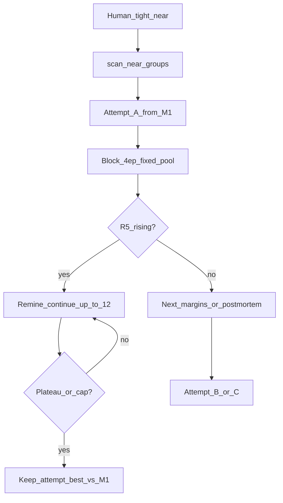

# Phase3b — hierarchical margin + fixed margin attempts

**Status:** **STAGE FAILED** (2026-09-26). Global winner = Phase1 (R@5 0.852). Attempt A only run; B/C not executed. Do not ship phase3 weights.  
**Stage report (handoff):** [`../reports/phase3b_stage_FAILED.md`](../reports/phase3b_stage_FAILED.md)  
**Attempt A detail:** [`../reports/phase3b_attempt_a.md`](../reports/phase3b_attempt_a.md)  
**Logs:** `data/train_dataset/embed_train_data/_logs/`  
**Date:** 2026-09-26  
**Handoff:** [`../drafts/dino_train/HANDOFF_PHASE2_TO_PHASE3.md`](../drafts/dino_train/HANDOFF_PHASE2_TO_PHASE3.md)  
**Recipe detail:** [`../drafts/dino_train/STRATEGY_PHASE3B_MARGIN.md`](../drafts/dino_train/STRATEGY_PHASE3B_MARGIN.md)  
**Notebook:** [`../drafts/dino_train/embed_train_v3.ipynb`](../drafts/dino_train/embed_train_v3.ipynb) (rebuild: `_build_embed_train_v3.py`)  
**Margin prep:** `uv run python scripts/build_margin_tiers.py --scan`  
**Colab upload:** `data/train_dataset/embed_train_data/near/near_groups.csv` → Drive `…/2_embed_train_data/near/near_groups.csv` (optional: `margin_tiers.csv` / report for QA only). Dataset/models unchanged.  
**SSOT for this ticket:** **this file** under `agent_docs/plans/`.

---

## Verdict / base

- Phase2 **FAILED** — do not continue from Phase2 weights.
- Start: `phase1/best_adapter` (Colab Dev-A R@5 **0.852**).
- Loss: InfoNCE + hinge hierarchical margin; **no hard-CE**.
- Near CSV: human tight-only → `near/near_groups.csv`.

---

## Mechanics: two strategies combined — yes

```text
L = InfoNCE(batch)  +  λ * Hinge_hierarchical(mined tiers)
```

| Layer | Role | Who is pos / neg |
|-------|------|------------------|
| **InfoNCE** (as Phase1) | Основной pull пары | В батче: `(q_i, g_i)` = positive; остальные `g_j` = in-batch negatives (случайные соседи по sampler). Near-список тут **не** участвует. |
| **Hierarchical hinge** (новое) | Шкала cosine: near ≪ same-winery ≪ far | Mined вне батча из **замороженного M1-индекса**; near mask; same-winery mid; far = top-K |

Это не «вместо InfoNCE», а **надстройка**. Phase2 заменял надстройку на hard-CE — отказались.

### Позитивы (две градации, **статика** на весь attempt)

| Tier | Смысл | Как учим | Меняется по эпохам? |
|------|--------|----------|---------------------|
| **P0 — true positive** | GT / market pair `g_i` | InfoNCE pull | Нет (пары из датасета) |
| **P1 — near twin** | Тот же tight `group_id` | **Не** в hard-neg; hinge: `sim(q,g) ≥ sim(q,near) + m_near` (сотые) | Нет — список из `near_groups.csv` |

Same-winery **не позитив**: это mid-negative (слабое отталкивание), см. ниже.

### Негативы (иерархия + mining)

| Tier | Отбор | Margin (геометрия cosine) | Soft/hard rank? |
|------|--------|---------------------------|-----------------|
| **N1 — same winery** | Тот же winery, не near | `m_sw` ≈ 0.08–0.12 | Нет отдельного soft/hard — один `m_sw` на tier |
| **N2 — far hard** | Top-K по cosine к `q` из **frozen M1** index; **исключить** near (+ обычно same-winery из far pool, они уже N1); filter `sim(h) < 0.95·sim(g)` (semi-hard, не twin) | `m_far` (явный, ≥ `m_sw`) | **Внутри N2 — нет**: все выбранные far получают **один** `m_far`. Ранжирование = только отбор в pool (top-K + filter), не разные margins по «насколько hard» |

Итого на ваш вопрос: **не** «всё близкое не из near отодвигаем на константу». Только то, что попало в **N1** (same-winery sample) или **N2** (top-K semi-hard). Остальной каталог в hinge не входит (частично давится только случайным InfoNCE in-batch).

**`λ`** = вес члена hinge в сумме лосса (не путать с `m_*`).  
**`m_*`** = целевой зазор `sim(pos) − sim(neg)`.

Hinge (схема): `max(0, sim(q,neg) − sim(q,pos) + m_tier)` по соответствующему tier.

### Эпохи и hard-pool: что было заявлено vs как делаем

| Источник | Сколько эпох |
|----------|----------------|
| Notebook сейчас | Phase1 = **8**, Phase2 = **6** (уже откатаны) |
| Old STRATEGY / handoff Phase3 | «**3–4** epochs, early stop» — это было как **короткий потолок**, устарело |
| **Этот план (locked)** | **4 = размер блока (не max train)** |

**Блок = 4 эпохи с одним N2-pool.**

```text
ep 1–4:   mine once → train → смотрим R@5
          ├─ нет роста vs старт attempt / ниже M1 и не чинится → STOP attempt → next margins from M1
          └─ R@5 растёт (или ≥ M1 и тренд вверх) → CONTINUE
ep 5–8:   remine N2 (новый top-K с текущего индекса или снова от M1-index — см. ниже) → train
          └─ пока растёт — ещё блоки; стоп когда плато 1 полный блок или soft-cap
```

**Locked:**

| | Значение |
|--|----------|
| `pool_block_epochs` | **4** (минимум, за который ждём сдвиг; lifetime одного N2-pool) |
| После блока, если R@5 **растёт** | **не останавливаем** — следующий блок + **обновление негативов** |
| Remine | каждые **4** эпохи, только если идём дальше (не mid-block) |
**Не «обязательно 12 эпох».** Soft-cap = потолок, не план минимума.

| Ситуация после блока | Действие |
|----------------------|----------|
| ep1–4: R@5 **не растёт** | **Не** идём до 12. Меняем margin-set (B/C), restart с M1 |
| ep1–4: R@5 **растёт** | Оставляем те же margins, remine, ещё блок(и) |
| Рост продолжается | Продолжаем до плато или soft-cap **12** |
| Плато за целый блок (даже до 12) | Stop, берём best checkpoint attempt |

Итого: 12 — только если стратегия «поехала» и ещё есть запас; провал margins отсекается уже на **4** эпохах.

Индекс для remine на ep5+: **текущая** модель (актуальные hard), не снова «замороженный снимок старта attempt» — иначе после прогресса снова бьём устаревшие цели. Mine на ep1 attempt — от **M1 index** (стабильный старт).

Диагностика по блоку: mean `sim(q,hard)`, active hinge rate, R@5. Gate — **R@5**; distance объясняет, не заменяет.

| Knob | В grid A/B/C? |
|------|---------------|
| `m_near`, `m_sw`, `m_far`, `λ` | Да |
| `pool_block_epochs=4`, soft-cap=12 | Нет — константы |

---

## Margins: fixed attempts, not dynamic mid-run

**Decision (locked):** three **fixed** margin sets (A → B → C). No automatic / online retuning of `m` or `λ` inside an epoch loop.

| Why not dynamic | Why fixed grid |
|-----------------|----------------|
| Dev-A = 27 queries → noisy signal for adapting m | Clean A/B attribution: each attempt restarts from **M1** |
| Changing m mid-run confounds “weights drift” vs “knob change” | Early-stop per attempt is enough feedback |
| Extra code + failure modes under deadline | If A/B/C all fail → likely **strategy**, not “wrong hundredths” |

**Per attempt:**

- Блок 4 ep: один N2-pool; не менять margins mid-run.
- После ep4: растёт → continue + remine каждые 4; не растёт → next attempt from M1.
- Soft-cap 12 ep; best_adapter = лучший R@5 внутри attempt; глобально vs M1.

**Grid** (`m_*` + `λ`; `pool_block=4`, soft-cap=12, `top_k=10`):

| Attempt | m_near | m_sw | m_far | λ |
|---------|--------|------|-------|---|
| A | 0.04 | 0.11 | 0.18 | 0.15 |
| B | 0.03 | 0.08 | 0.14 | 0.10 |
| C | 0.05 | 0.12 | 0.22 | 0.20 |

**After 3 failed attempts:** stop tuner; read Colab retrieval csv + top-5 relation mix → **new hypotheses** (objective / mining / data), not a 4th blind margin grid and not refresh-tuning.

Optional later (out of scope now): human-triggered “attempt D” with hand-picked m after log review — still fixed set, not online adaptive.

---

## Flow



---

## Near clusters layout + singleton scan (2026-09-26)

**Path:** `data/train_dataset/near_clusters/` (human still reviewing large wineries).  
After cleanup → `scan_near_groups.py` → copy/symlink result to `embed_train_data/near/near_groups.csv` for Colab.

### How margins map to folders (reminder)

| Layout | `kind` / group | Train role |
|--------|----------------|------------|
| Subfolder cluster (tight visual twins) | one `group_id` | **P1 near** — mask from hard-neg; `m_near` |
| Each image alone (root or `singletons/`) | own `group_id` | **not** near; if same winery → **N1** `m_sw` |
| Same winery, different clusters | different `group_id` | **N1** `m_sw` between clusters |
| Cross-winery hard | mined top-K | **N2** `m_far` |

### Convention (locked)

1. **Singletons → winery root** (preferred). Avoid `singletones` typo; scanner will accept both `singletons` / `singletones`, but root is safest so nothing is lost to naming.
2. **n < 5:** всё = singletons + only weak same-winery (`m_sw`). **Не** один near-кластер `::all`. Human не ревьюит.
3. **5 ≤ n < 20:** отсутствие папки `singletons` — **норма**; не блокер. Ревью по желанию.
4. **n ≥ 20:** human tight-only clusters; отметить, если нет ни `singletons*`, ни root-одиночек (всё свалено в cluster_*).

### Scan result (115 wineries)

| Bucket | Count | Notes |
|--------|------:|-------|
| n≥20 | 32 | 30 with `singletons/`; **0** typo `singletones`; **0** root imgs today |
| 5–19 | 64 | 34 without `singletons/` — OK by rule |
| n<5 | 19 (68 imgs) | all under a single `group/` subdir today |

**Typos `singletones`:** none found.

**n≥20 — MARK: no singleton place** (all images only in cluster subdirs):

1. `020_Domaine Lipko` (20) — dirs `1..4`
2. `021_Имение Сикоры` (21) — `cluster_00_n11`, `cluster_01_n8`, `cluster_02_n2`

**n≥20 with `singletons/`:** 30 wineries (Фанагория…Belmas) — OK structurally; content still human-reviewed for tight-only.

**5–19 without `singletons/` (mark, not urgent):** 34 dirs — typically all files in `1`/`2`/`group` as one or few clusters (GAVRAS…Золотое Поле). Treat as “no explicit singleton folder”; after review either split or leave clusters / move leftovers to root.

**n<5:** 19 wineries, each one folder `group/` with all images → current scanner would emit **one near cluster**. **Must change** on rescan: each file = singleton (or flatten to root).

### Scanner / layout follow-ups

- **Locked:** keep existing `singletons/` vs root as-is (both already work in `scan_near_groups.py`). No mass rename.
- Prep script: [`scripts/build_margin_tiers.py`](../../scripts/build_margin_tiers.py) (`--scan` optional).
- Notebook Phase3b: done in `embed_train_v3.ipynb`.

---

## Closed (no open questions)

- Base = M1; Phase2 archive only.
- Two losses combined: InfoNCE + hierarchical hinge (not hard-CE).
- Far negs: top-K semi-hard, one `m_far` inside pool — no soft/hard margin ladder inside N2.
- Positives: P0 + P1 (near) static; same-winery = N1 mid-neg, not positive.
- Hard-pool: **block=4** (min window + pool lifetime); if R@5 rises → continue + remine every 4; soft-cap **12**; fail attempt only after first block flat. **12 ≠ mandatory.**
- Near: tight clusters only; singletons at root preferred; n<5 all singleton + `m_sw`.
- Tight near + same-winery floor; no dataset rebuild.
- Deep-miss / OCR out of timebox.
- Metric SSOT = Colab Dev-A (not local ONNX tie).
- Plans live in `agent_docs/plans/`.

---

## Implementation todos

1. Human: finish near review (incl. 10–20); leave singleton folder names as-is.
2. `uv run python scripts/build_margin_tiers.py --scan` → upload `near/near_groups.csv` to Drive.
3. Colab: `PHASE=3`, `ATTEMPT_ID=A|B|C` from M1; notebook already has Phase3b cell.
